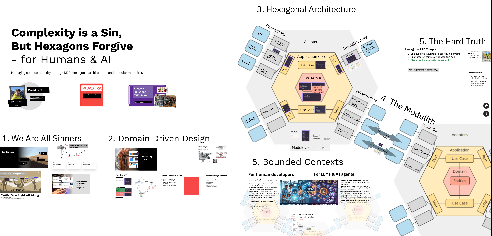

# Complexity is a Sin, But Hexagons Forgive — for Humans & AI

> Managing code complexity through DDD, hexagonal architecture, and modular monoliths.

A talk by **David Lebl** on keeping codebases navigable —
for human developers *and* AI agents — using Domain-Driven Design, hexagonal
architecture, and the modulith.

- **Meetup:** London Scala User Group — 10 June 2026 — https://www.meetup.com/london-scala/events/314842956
- **Slides (Prezi):** https://prezi.com/view/1krnrB6TgG4Ct13W9leo
- **Slides (PDF):** [slides.pdf](slides.pdf)

## References

My Hexagons guideline repo: **Scala Project Style Guide** — https://github.com/david-lebl/scala-project-style-guide

**Inspired by:**

- Complexity is a Sin by Volodymyr Yaroslavskyi: https://www.youtube.com/watch?v=qBfQWtUa4U8
- Pathodental Complexity by Alexander Ioffe: https://www.youtube.com/watch?v=8PJ8zq0XFSA
- Diamond architecture — ScalaDays 2023 by David Amancio Gil Méndez: https://www.youtube.com/watch?v=CkWRg4A2YhQ
- Diamond architecture — DevInsideYou:
  - https://www.youtube.com/watch?v=B6bmlh1hCLo
  - https://github.com/DevInsideYou/pfps-shopping-cart/tree/diamonds
- Modeling in Scala, part 1: modeling your domain - https://kubuszok.com/2024/modeling-in-scala-part-1/
- *Domain Modeling Made Functional* — book by Scott Wlaschin: https://share.google/GzSThdgT1UOdJtIWA

## Summary

### 1. We Are All Sinners

We all ship complexity. The talk catalogs the common mistakes:

- **Experimentation without cleanup** — the "quick prototype" stays forever.
- **Misunderstanding abstractions** — clever FP patterns nobody else can work with.
- **Undefined domain boundaries** — everything talks to everything (spaghetti).
- **The worst sin: inconsistency** — one "better" module, chaos everywhere else.

**Types of complexity** (know your enemy):

- **Essential / Computational** — inherent to the problem; unavoidable & OK.
- **Accidental** — caused by bad choices or lack of knowledge; *the main target*.
- **Pathodental** — accidental complexity you've convinced yourself is essential
  ("smart" solutions nobody understands). Clever ≠ good.
- **Cognitive** — how much you must mentally juggle; *the primary focus*.

The Dunning–Kruger curve of complexity: writing complicated code *feels* smart at
the "Peak of Mount Stupid"; maintenance reveals the truth; mastery is simplicity.

### 2. Domain-Driven Design

From a **God Service** anti-pattern (one `UserService` with 100 functions),
through a naive **split by entity** (still tangled, services call each other),
to the **O(n²) nightmare** where every feature touches N layers across M modules.

Core DDD ideas: **ubiquitous language**, **bounded contexts**, high cohesion /
loose coupling between domains.

**Guidelines established:**

1. **Consistency > Perfection** — be consistent even if it's not ideal.
2. **Reduce necessary context** — minimize what you must hold in mind.
3. **Explicit over clever** — pathodental avoidance.
4. **Domain-backed decisions** — not technology-backed.
5. **Agnostic to calling point** — design shouldn't leak implementation details.

### 3. Hexagonal Architecture

The application core surrounded by ports and adapters:

- **(Pure) Domain** — entities, value objects, aggregates, domain services.
- **Use Case** — orchestrates the domain; the application core.
- **In Port / API** — the public, cross-domain contract (REST, gRPC, CLI, Kafka).
- **Out Port** — effectful interfaces the core depends on (e.g. stores).
- **Adapters** — concrete implementations (e.g. a Postgres store).
- **Mapping** — translate DTO/DAO ↔ domain at the boundary; avoid leaking the DB model.

Prefer **use-case-focused** modules over entity-focused / CRUD-style services.

### 4. The Modulith

A modular monolith: same hexagonal structure, but adapters can be **direct**
(no network, no controller needed) or remote (HTTP, with the network cost made
explicit). This gives microservice-style isolation without the distributed-systems tax.

**Project structure** organized by module, not by layer (layers and features both
lead to spaghetti). Each module splits into `core` / `db` / `http` / `impl` / `it`.

**Benefits:** isolation of change & failure, high cohesion + low coupling,
encapsulation & data ownership, lower cognitive load, testability in isolation,
refactor behind a stable contract, parallel work without collisions. Microservices
add independent deploy/scaling and polyglot — *at a cost*.

### 5. Bounded Contexts — for Humans & AI

The same boundaries pay off twice:

- **For human developers:** lower cognitive load, contained bugs (small blast
  radius), testability in isolation, free refactoring behind a stable contract,
  fast onboarding, clear ownership & accountability.
- **For LLMs & AI agents:** context-window optimization (only one module + ports
  enter the prompt), less noise / higher fidelity, precise knowledge boundaries
  (the port is an explicit contract), isolated impact zone, contained blast radius
  (compile + module tests gate regressions at the boundary).

**Enforced isolation** with structural rules (e.g. ArchUnit) keeps the
organization navigable.

### The Hard Truth

Hexagons *are* complex. But:

1. Complexity is inevitable in non-trivial domains.
2. **Unstructured** complexity is cognitive hell.
3. **Structured** complexity is navigable.

> Do hexagons forgive complexity? *"It depends."*

**The Commandments:** minimize cognitive load · define domain boundaries · be
consistent (even if imperfect) · test as design verification · refactor
continuously · make it functional. :]
